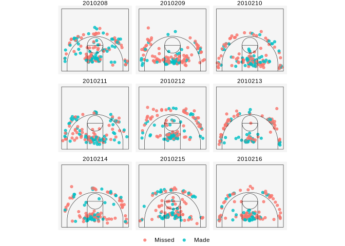

rfeb
====

rfeb provides a set of tools for scraping and analyzing basketball data from Spain's FEB leagues.

Installation
------------

``` r
# install.packages("devtools")
devtools::install_github("solmos/rfeb")
```

Examples
--------

``` r
library(rfeb)
library(ggplot2)
game_ids <- 2010208:2010216
shots <- extract_shots(game_ids)
plot_shotchart(shots, color = made) +
    facet_wrap(~game_id)
```


